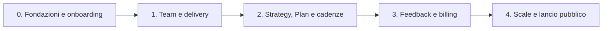

# Piano di implementazione end-to-end di Magister

## Scopo

Questo è il piano di implementazione dell'intera applicazione, non della sola
console. Copre insieme:

- schema dati e migrazioni;
- autenticazione, tenancy e Policy;
- work graph e boundary di scrittura;
- runtime Eve, agenti, dispatcher e sessioni;
- connessioni e operazioni verso provider esterni;
- console, sito pubblico e flussi self-service;
- crediti, billing, osservabilità e operazioni di produzione;
- test automatici, canary reali e prove di ripristino.

Il frontend è un workstream di ogni fase. Non ha una roadmap parallela: ogni
capability è completa soltanto quando il suo dato canonico, il boundary server, il
runtime, la superficie utente e la verifica end-to-end arrivano insieme.

Le cinque macro-fasi estendono la roadmap di
[ARCHITECTURE.md](./ARCHITECTURE.md#roadmap). Possono contenere più PR e più
work package, ma una fase non è conclusa finché il viaggio utente indicato non è
interamente testabile.

## Baseline reale

Al momento della stesura il repository è una specifica architetturale avanzata
sopra uno scaffold, non un'applicazione parzialmente implementata:

- `apps/app` e `apps/web` sono ancora scaffold Next.js 16;
- `apps/agent` dichiara Eve 0.31.3 ma non contiene ancora un agente;
- `packages/ui` contiene le primitive shadcn, non componenti di prodotto;
- non esistono ancora `packages/db`, `packages/brain`, `packages/policy`,
  `packages/connections`, `packages/agents`, `packages/marketing-skills` o
  `packages/env`;
- non sono implementati Better Auth, Neon/Drizzle, Vercel Blob, Context.dev,
  Vercel Connect, AI Gateway, provider marketing o billing;
- non esistono test runner, migration test, browser E2E o workflow CI;
- i comandi correnti compilano soltanto le due app Next e verificano i tipi di
  `app`, `web` e `ui`; nessun agente viene ancora costruito o verificato;
- la root dichiara Node `>=18`, mentre Eve richiede Node 24 nel suo package.

I [wireframe](./design/branderize-cmo-wireframe.png) e
[rendering](./design/branderize-cmo-realistic-render.png) approvati restano
riferimenti trasversali per gerarchia e art direction. Non sono una fase né una
fonte di verità per il dominio.

## Fonti normative

Questo documento ordina il lavoro ma non riscrive i contratti. In caso di dubbio
prevalgono:

- [ARCHITECTURE.md](./ARCHITECTURE.md), per la mappa complessiva;
- [ADR-001](../adrs/001-multi-tenant-saas.md), per tenancy e ruoli;
- [ADR-002](../adrs/002-postgres-work-graph.md),
  [ADR-008](../adrs/008-brain-write-path-and-model-resolution.md) e
  [ADR-014](../adrs/014-schema-singletons-sessions-streams-ledger.md), per grafo,
  schema e write path;
- [ADR-009](../adrs/009-agent-deployment-and-console-data-surface.md),
  [ADR-015](../adrs/015-the-registry.md),
  [ADR-017](../adrs/017-consultative-subagents-durable-root-work.md) e
  [ADR-018](../adrs/018-one-shot-durable-agent-tasks.md), per agenti, registry e
  task durevoli;
- [ADR-013](../adrs/013-policy-matrix-lateral-edges-sandbox.md) e
  [ADR-019](../adrs/019-human-approved-external-commitments.md), per Policy ed
  effetti esterni;
- [ADR-010](../adrs/010-plan-as-derivation.md),
  [ADR-020](../adrs/020-typed-decisions-and-impact-verification.md) e
  [ADR-021](../adrs/021-plan-advancement-and-human-readiness-override.md), per
  Strategy, Plan, Verification e avanzamento;
- [ADR-016](../adrs/016-eve-session-state-persistence.md), per privacy,
  persistenza e recovery delle conversazioni.

## Regole di esecuzione

### Le fasi sono vertical slice

Ogni feature attraversa sempre, nello stesso workstream:

1. schema, migrazione e contratto tipizzato;
2. regole Policy, tenancy, replay e concorrenza;
3. boundary di `packages/brain` e proiezioni;
4. registry, runtime o adapter esterno quando necessari;
5. superficie utente con stati happy, empty, loading, error, stale e permission;
6. test dal browser fino al dato o receipt canonico;
7. telemetria, runbook e rollback proporzionati al rischio.

Uno schema senza viaggio utente e una UI alimentata soltanto da fixture non
chiudono una macro-fase. Le fixture restano un banco prova interno.

### Dipendenze tra package

La direzione delle dipendenze è stabile:

```text
packages/db + packages/policy + packages/agents registry
  -> packages/brain
  -> apps/app e adapter deterministici
  -> agent root e dispatcher

packages/connections
  -> tool di lettura autenticati e handler diretti
  -> mai token nel graph, nei task o nelle sessioni
```

- `packages/brain` è l'unico write path del grafo.
- Le app possono dipendere da `brain`; `brain` non dipende dalle app.
- Ogni root Eve monta wrapper sottili generati dal registry condiviso.
- Il sito pubblico non importa runtime agentico o accesso diretto al grafo.
- Le variabili d'ambiente sono validate per deployment; non esiste un `.env`
  implicitamente condiviso tra tutti i progetti.
- Le task di test/build sono dichiarate prima nei package proprietari e poi
  orchestrate dalla root con `turbo run`.

### Nessuna falsa capability

- Un bottone compare soltanto quando il relativo boundary reale è attivo.
- Un adapter finto, un provider di inferenza scripted o un clock controllato sono
  selezionabili solo da una build di test server-side.
- Una build production fallisce se contiene o può risolvere un test provider.
- Il laboratorio mostra sempre `Dati sintetici`, è `noindex` e non può essere
  attivato da query string, cookie, header o input del browser.
- Il modello non è mai usato come authorization boundary.
- Ogni publish, send, activate, spend, pause, unpublish, cancel o close esterno
  mantiene il bottone umano previsto da ADR-019.

## Definition of done comune

La Fase 0 introduce una convenzione uniforme di script. Da quel momento ogni
fase deve passare dalla root:

```text
pnpm check
pnpm check-types
pnpm test
pnpm test:integration
pnpm test:e2e
pnpm build
```

Gli script root delegano a Turbo; i package eseguono le proprie suite. Il gate di
`main` esegue l'intero grafo, mentre le PR possono aggiungere una corsia
`--affected` senza sostituire il gate completo.

Ogni fase richiede inoltre:

### Contratti e database

- parsing positivo e negativo di tutti gli schema chiusi introdotti;
- migrazione da database vuoto e migrazione dalla release precedente;
- constraint, indici parziali, FK same-brand e cascade testati su Postgres reale;
- replay, lost response e almeno le race normative degli ADR proprietari;
- nessun test di dominio affidato a mock di Drizzle o a un database in memoria.

### Agenti e provider

- il vero runtime Eve, il vero proxy, i veri hook e i veri boundary `brain` in
  test;
- un provider di inferenza test-only scripted per rendere deterministiche tool
  call, streaming, partial result, errori e retry;
- `eve build`, health check e una sessione completa per ogni root modificato;
- adapter provider test-only che registra chiamate e receipts senza uscire verso
  internet;
- un canary staging separato con modello e provider reali quando la fase li
  introduce. Il canary non sostituisce la CI deterministica.

### Browser e prodotto

- un E2E che attraversa browser, Server Action o proxy, boundary, database e
  risposta renderizzata;
- assertions sul receipt o sulla riga canonica, non soltanto sul testo della UI;
- matrice `owner | admin | member | viewer`, cross-tenant e removed Member;
- WCAG 2.2 AA, navigazione tastiera, focus visibile, zoom 200%/400% e assenza di
  scroll orizzontale a 320 px;
- screenshot deterministici alle viewport principali e ai bordi dei breakpoint;
- nessun transcript privato nelle proiezioni condivise e nessun secret in HTML,
  log browser, task, Action o output modello.

### Operazioni

- env schema, deployment manifest e health check aggiornati;
- logging con correlation id e redazione dei dati sensibili;
- dashboard/alert sulle failure introdotte dalla fase;
- procedura di rollback che non viola una migrazione, un receipt o una garanzia
  mostrata dalla UI;
- evidenze conservate in CI: test report, trace E2E, screenshot diff e migration
  log. Un check verde da solo non prova il viaggio prodotto.

## Riepilogo delle macro-fasi

| Fase | Incremento prodotto | Viaggio che chiude la fase |
| --- | --- | --- |
| 0 | Fondazioni e primo stato canonico utilizzabile | signup -> brand -> Intent -> Brand Context -> CMO refinement -> Object provenance |
| 1 | Team che consegna e primo commitment umano | richiesta lavoro -> task -> Artifact -> approval -> una chiamata provider -> Result |
| 2 | Grafo abitabile, Strategy e Plan | Strategy -> Decision -> rebuild -> Plan -> wave -> domanda/risposta -> digest |
| 3 | Feedback misurabile ed economia | commitment -> outcome -> metriche -> Verification -> credits/billing |
| 4 | Scale e self-service pubblico | signup pubblico o agent-native -> primo Plan -> commitment approvato -> verifica operativa |



---

## Fase 0 - Fondazioni e primo stato canonico utilizzabile

### Stato finale

Un utente può autenticarsi, creare organizzazione e brand, dichiarare il primo
Intent, importare un Brand Context verificabile, parlare con il proprio CMO e
raffinare l'Intent. Intent, Object e Action sono dati canonici e condivisi
nell'organizzazione; la conversazione resta owner-private.

Questa fase assorbe il design system e il banco prova frontend: non esiste una
precedente “fase UI” separata.

### Work package inclusi

#### Piattaforma e qualità

- allineare repository e CI a pnpm 9, Node 24 e Turbo;
- introdurre Vitest o runner equivalente per unit/contract test, Postgres reale
  per integration test e Playwright + Axe per E2E;
- aggiungere workflow CI, artefatti di failure e contratti env per ogni app;
- fissare i server E2E multi-app: `apps/web` su 3000 e `apps/app` su 3001,
  avviati come due `webServer` Playwright distinti;
- creare fixture server-only, clock controllato e scripted inference provider;
- fissare tema, tipografia, responsive shell e primitive di prodotto usando i due
  riferimenti visuali approvati;
- costruire in CI sia `apps/app` sia `apps/web` e tutti i root agentici presenti.

#### Dati, auth e dominio

- creare `packages/env`, `packages/db`, `packages/policy`, `packages/brain` e il
  nucleo di `packages/agents`;
- configurare Drizzle, `pg.Pool` sul pooled Neon URL e connessione diretta per le
  migrazioni;
- implementare Better Auth con User, organizzazioni, Member e Google sign-in;
- implementare brand, Human/System/Agent Actor, Intent, Action, Object, Blob
  reference e operation receipt necessari al viaggio;
- introdurre da subito `session_events` e il nucleo append-only di
  `credit_ledger`: ogni primo step modello viene attribuito e deduplicato, anche
  se pricing, fatturazione e UI commerciale arriveranno in Fase 3;
- creare per l'alpha un grant iniziale deterministico e non commerciale, così il
  primo task agentico attraversa già il vero admission check. Importo, pricing e
  replenishment customer-facing non vengono dedotti da questo seed;
- implementare le prime proiezioni tenant-safe e il pure Policy evaluator;
- creare l'Actor umano in modo idempotente e derivare il ruolo soltanto dal
  Member corrente;
- introdurre tabella `schedules`, union registry `ScheduleTemplate` e
  `reconcileBrandSchedules`; alla creazione del brand i template correnti
  vengono inseriti in stato disabled, senza ancora esporre configurazione o
  materializzazione.

#### Contesto iniziale

- implementare l'adapter server-side Context.dev per brand kit e crawl;
- validare, hashare e caricare le varianti binarie in Vercel Blob prima del
  commit canonico;
- committare Brand Context v0 e Artifact tramite `packages/brain` con Actor
  `system:context-dev`;
- offrire retry esplicito e una proiezione di stato senza trasformare un errore
  esterno in un Brand Context finto.

#### Eve, task e CMO minimo

- sostituire lo scaffold generico `apps/agent` con i sette target root previsti e
  farne compilare il manifest condiviso; in questa fase sono funzionali CMO e
  Product Marketer, mentre gli altri possono esporre soltanto health/registry
  senza task kind attivi;
- implementare `agent-cmo`, il proxy autenticato di `apps/app`, la conversazione
  application-owned, streaming/reconnect e audit hook;
- proiettare dal winning `step.completed` il model usage della prima
  conversazione/task e verificare che retry, replay e compaction seguano già il
  contratto ADR-014;
- implementare il primo task one-shot Product Marketer, claim, TaskCompletion e
  Object prodotto;
- implementare già per quel task queue, claim, Vercel Cron fan-out e dispatcher
  payload-free. Le fasi successive estendono il registry e le lane, non
  introducono un secondo meccanismo di dispatch;
- conservare la completion `partial | blocked`, mostrare le sue domande nel
  dettaglio task e permettere la risoluzione tramite un nuovo turno nel CMO del
  caller più la receipt `task_questions_resolved`; la inbox aggregata arriverà
  in Fase 2;
- montare la consultazione Product Marketer read-only e il boundary
  `refineIntent` nel CMO;
- montare `request_specialist_work` soltanto nel top-level CMO e, in questa fase,
  limitarlo ai kind Product Marketer: il turno umano deve identificare senza
  ambiguità l'Intent attivo da cui trusted code costruisce lo snapshot;
- mantenere deny-all nel sandbox locale quando non è disponibile un backend che
  applichi l'allowlist di rete.

#### Superficie utente

- landing/sign-in minimo in `apps/web`;
- onboarding org/brand, sito, Intent iniziale e stato import in `apps/app`;
- console v0 con brand switcher, Intent detail, Object browser e provenance;
- Work detail minimo per il task Product Marketer, inclusi output e domande;
- CMO privato con send, stream, stop, reload e fallback read-only;
- nessuna CTA Strategy, Plan, approval o schedule prima delle rispettive fasi.

### Viaggi obbligatori

1. **Onboarding canonico**
   - autenticazione;
   - creazione organizzazione e brand con `website_url`;
   - Intent umano active rev.1;
   - adapter Context.dev;
   - Brand Context e Artifact con producing Action;
   - traversal browser fino all'Actor e alla provenienza.
2. **Refinement tramite CMO**
   - il proprietario apre la propria conversazione;
   - il CMO consulta Product Marketer e pone una domanda;
   - una risposta non ambigua raffina l'Intent;
   - reload e reconnect mostrano lo stesso stato canonico e transcript.
   - se il task Product Marketer termina partial/blocked, la domanda resta nel
     task detail finché un successivo turno CMO risolve l'intero bundle; il
     semplice click non la nasconde e non rilancia il task.
3. **Privacy e tenancy**
   - Bob, stesso org, legge Intent/Object di Alice;
   - Bob non elenca né apre la conversazione di Alice, anche se admin;
   - un utente di altra organizzazione non legge né muta il brand;
   - il viewer proprietario legge la propria conversazione e può soltanto
     fermare l'esatto turno osservato.

### Exit gate

La fase è conclusa quando i tre viaggi passano in CI con Context.dev e inferenza
scripted attraverso i boundary reali, poi in staging con Google auth, Context.dev,
Blob, Neon e un modello AI Gateway reali. Il root Product Marketer deve produrre
almeno un Object task-linked e ogni root deve superare build e health check. La
console fixture-driven, da sola, non chiude la fase.

### Non ancora attivo

- specialisti Content, Distribution, SEO, Lifecycle e Growth;
- connessioni provider e commitment esterni;
- Strategy, Plan, Decision amministrative e schedule configurabili;
- crediti, billing, MCP e ads.

---

## Fase 1 - Il team che consegna e il primo commitment umano

### Stato finale

Da un Intent attivo il CMO può richiedere lavoro specialistico durevole. Content,
Distribution e SEO Discovery producono Artifact/Evidence tracciabili. Almeno un
kind può preparare una proposta verso un provider reale; l'effetto esterno parte
soltanto dopo review e click umano e genera un Result canonico.

### Work package inclusi

#### Registry, agenti e dispatcher

- completare il registry compilato per CMO, Product Marketer, Content,
  Distribution e SEO Discovery;
- integrare e materializzare `packages/marketing-skills` con build riproducibile;
- generare wrapper locali, tool set, output contract, sandbox e supported kinds;
- estendere queue, claim e dispatcher della Fase 0 ai nuovi root e kind,
  completando settlement, cancel e task output inventory. La recovery può
  riprovare soltanto un handoff non ancora provato; dopo il binding di una
  sessione agentica non redispatcha, e un commitment umano resta one-shot con
  outcome conservativo;
- registrare step/session telemetry e model usage senza usare la telemetry come
  product state.

#### Connections e preparazione

- creare `packages/connections` e `brand_connections`;
- implementare onboarding Vercel Connect per i primi slot Notion e Typefully;
- usare sempre il subject app-scoped con installazione brand-scoped risolta da
  trusted code;
- introdurre soltanto operazioni di lettura e preparazione create-only dichiarate
  dal registry;
- salvare documenti e asset per id, senza passare blob o token tra agenti.

#### Commitment diretto

- implementare task `direct/human`, renderer chiuso, edit, approve e cancel;
- valutare current Member e Policy al click e congelare Approval, prezzo e
  payload canonicalizzato;
- eseguire la chiamata provider con TypeScript deterministico, senza modello;
- appendere Result `accepted | rejected | unknown` e settlement nella transazione
  prevista;
- implementare provider-outcome poll soltanto per contratti che offrono lookup
  durevole e cadenza limitata; se il primo kind lo usa, anche la relativa
  provider-outcome Verification entra in questa fase;
- congelare sempre il billing snapshot dell'Approval. Il primo kind può essere
  dichiarato esplicitamente `non_billable`; un kind priced deve già produrre un
  solo `action_charge` sul solo esito succeeded.

#### Superficie utente

- Today iniziale con “richiede il tuo giudizio”, lavori attivi e risultati;
- Work list/detail con polling soltanto durante lavoro attivo;
- Artifact/Evidence preview, download autenticato e provenance;
- Connections con slot, account effettivo, capability gap e reconnect;
- Approval inbox con CTA specifica, non “Approva tutto”;
- stati stale, busy, queued, running, failed, unknown, expired e regeneration.

### Viaggi obbligatori

1. **Specialist work**
   - l'utente chiede esplicitamente lavoro sull'Intent corrente;
   - il CMO crea o osserva il task;
   - il root corretto reclama la row, usa Eve e produce Artifact/Evidence;
   - TaskCompletion, output e producing Actions sono visibili in console.
2. **External delivery**
   - il task prepara una proposta;
   - la proposta compare in approval inbox;
   - un Member autorizzato la rivede o modifica e approva;
   - avviene esattamente una chiamata provider;
   - receipt, Result e stato terminale restano leggibili dopo reload.
3. **Replay e autorità**
   - doppio click e lost response convergono;
   - edit-vs-approve e cancel-vs-claim hanno un solo vincitore;
   - viewer e ruolo rimosso non approvano;
   - downgrade dopo Approval non riscrive il grant, mentre un cancel che vince
     prima del claim impedisce la chiamata.

### Exit gate

La fase è conclusa quando i viaggi passano con provider finto deterministico in
CI e con tutti i connector dichiarati per la v1 in workspace/account di staging.
Il canary deve provare provider call, Result Action e read-back, non soltanto un
`200`.
Nessun secret deve apparire nel grafo o nello stream. Notion e Typefully non si
considerano consegnati finché ciascuno non ha un journey e un canary dedicati. Se
la v1 viene ridotta a un solo provider, la stessa modifica deve aggiornare
roadmap, registry e superficie Connections: non si lascia il secondo come
promessa incompleta.

### Non ancora attivo

- Plan e route automatiche;
- schedule configurabili;
- Lifecycle/Growth e misurazione;
- billing e MCP.

---

## Fase 2 - Il grafo abitabile, Strategy, Plan e cadenze

### Stato finale

Il CMO coordina gli Intent attivi in una Strategy brand-wide e in un Marketing
Plan versionato. Il lavoro specialistico della Fase 1 viene instradato in wave,
il Piano si rivaluta, le domande incomplete tornano all'umano e la prima cadenza
brand-wide può essere abilitata senza creare autorità implicita.

### Work package inclusi

#### Decision e Policy completa

- implementare schema e read model dell'unione chiusa `roadmap_input |
  policy_restriction | model_override | intent_preauthorization`;
- abilitare in scrittura le varianti coperte dai kind disponibili nella fase. La
  prima Strategy usa `impact.not_applicable`; una Decision misurabile resta
  fail-closed e senza CTA finché Fase 3 non attiva atomicamente anche il task
  Growth richiesto;
- implementare presentation card read-only, report durevoli e `recordDecision`;
- gestire head replacement, expected head/revision, receipt-first replay e
  preauthorization legata all'esatta revisione Intent;
- esporre needs-reconfirmation senza riattivare automaticamente un grant;
- mantenere Strategy brand-wide con eventuale Intent soltanto causale.

#### Plan e wave

- implementare Evidence, Move Candidate e Marketing Plan con exact Object ids;
- implementare `rebuild-marketing-plan`, snapshot di tutti gli Intent attivi,
  `publishPlanAndRoute` atomico e dedup dei task;
- implementare `advance-marketing-plan`, wave Actions, ancestry wake-up,
  `Ricontrolla` e `Avvia comunque`;
- calcolare `plan_needs_rebuild` da Strategy e planning Intent snapshots;
- non usare `output_object_ids` o una terminal task come prova automatica di
  readiness.

#### Open questions, digest e graph

- estendere la risoluzione task-linked della Fase 0 alla proiezione aggregata di
  tutte le completion partial/blocked;
- implementare `Rispondi al CMO` con source task trusted e conversation del
  caller;
- chiudere il bundle soltanto con `task_questions_resolved` receipt-backed;
- costruire digest meccanico + narrativa con citation refs validate;
- completare graph browser, task queue, Intent lifecycle e Decision history.

#### Product cadence

- estendere il registry active/retired introdotto in Fase 0 con i template
  eseguibili della release;
- per ogni nuovo template active, eseguire l'esplicito backfill
  `reconcileBrandSchedules` su tutti i brand esistenti e verificare che non
  sovrascriva configurazione o cursore delle row già presenti;
- implementare `configureSchedule` come boundary umano con revision CAS;
- usare un helper wall-clock/DST condiviso e versionato;
- materializzare occurrence categoricamente origin-free, con current
  restrictions e `structure_level = null`;
- introdurre la prima cadenza daily brief, disabilitata di default;
- implementare retirement e rollout/rollback root-first secondo ADR-009;
- mantenere `scheduleRecheck` separato e task-bound.

#### Superficie utente

- Today completo secondo la gerarchia del wireframe;
- Decision/Strategy cards con scope e conseguenze esplicite;
- Plan detail con Move, Evidence, dipendenze, Rebuild, Ricontrolla e Avvia
  comunque;
- live task queue, digest con citation traversal e Open questions;
- Schedules con template chiusi, timezone e stato del prossimo run;
- stati Plan current, rebuilding, stale, no-ready-moves e blocked.

### Viaggi obbligatori

1. **Strategy e Plan**
   - CMO presenta una Strategy tipizzata;
   - l'umano registra l'esatto payload;
   - recordDecision crea atomicamente il rebuild;
   - il CMO pubblica Plan, producing Action e route mapping;
   - un task termina e genera o osserva una rivalutazione;
   - il risultato è una nuova wave oppure `no_ready_moves`.
2. **Recovery del Piano**
   - un cambio Strategy/Intent rende il Plan stale;
   - Ricontrolla e Avvia comunque restano bloccati;
   - Ricostruisci resta disponibile e pubblica il nuovo head;
   - un segnale best-effort perso è recuperabile da Ricontrolla.
3. **Domande aperte**
   - un task termina partial/blocked con domande;
   - la card compare nella proiezione condivisa;
   - un non-viewer la porta nel proprio CMO;
   - la risposta non rilancia automaticamente il task;
   - l'Action di resolution nasconde la card e il replay converge.
4. **Cadenza**
   - un umano abilita daily brief con timezone;
   - il clock controllato raggiunge lo slot;
   - nasce una sola occurrence origin-free;
   - disable/materialize e duplicate dispatch linearizzano;
   - re-enable non produce catch-up e gap/fold DST usano gli instant attesi.

### Exit gate

La fase è conclusa quando tutti i viaggi passano su Postgres ed Eve reali con
inferenza scripted, incluso almeno un percorso con task Content/Distribution/SEO
della Fase 1. In staging un modello reale deve completare presentation, Decision,
rebuild e una valutazione del Plan. Il daily brief deve materializzarsi da un Cron
reale in un brand di staging senza effettuare alcun commitment non approvato.

---

## Fase 3 - Feedback misurabile, Lifecycle ed economia

### Stato finale

Magister osserva gli esiti dei propri commitment, misura Decision verificabili e
usa tali fatti per rivalutare il Piano. Lifecycle e Growth sono operativi. Modelli
e azioni consumano un ledger crediti auditabile; il prodotto distingue admission
agentica, costi reali e commitment già approvati.

### Decisione preliminare obbligatoria

Gli ADR definiscono ledger, charge e overage ma non scelgono ancora il contratto
di riscossione/invoicing. Prima di implementare la raccolta economica si deve
approvare un ADR breve che fissi provider billing, catalogo prezzi, ciclo invoice,
webhook, dispute/refund e relazione tra piano commerciale e `credit_ledger`.
Questa decisione non può essere inventata nel componente Credits.

### Work package inclusi

#### Agent e connessioni

- rendere funzionali Lifecycle e Growth;
- introdurre Resend per lifecycle e una fonte analytics registrata;
- aggiungere tool di sola lettura per metriche e preparazioni idempotenti;
- mantenere ogni send esterno nella lane `direct/human`;
- mostrare capability e data gaps anziché produrre metriche inventate.

#### Verification e feedback

- attivare la variante misurabile di `roadmap_input` insieme al relativo task
  Growth creato atomicamente da `recordDecision`;
- implementare provider-outcome, Intent-acceptance e Decision-impact
  Verification Actions;
- gestire poll pending/final, deadline ed exhaustion tecnica;
- dopo una Verification provider finale, risalire al commitment Plan-derived e
  fare il wake-up best-effort con key distinta dall'acceptance;
- implementare `verify-roadmap-decision-impact` origin-free e i report di
  reconsideration;
- mantenere ogni mutazione Decision come click umano separato.

#### Credits e billing

- completare e rendere commerciale il `credit_ledger` append-only introdotto con
  il primo modello, includendo grant, model charge e action charge;
- proiettare balance e admission senza reservation;
- attribuire soltanto step billable vincenti, ignorando la compaction nel ledger;
- registrare action charge soltanto su commitment billable succeeded;
- bloccare nuovi agent task quando il balance è zero o negativo, non la CMO
  conversation già attiva né le lane dirette previste dagli ADR;
- implementare plan allowance, overage e invoicing secondo l'ADR economico;
- confrontare AI Gateway Custom Reporting come diagnostica, mai come fonte di
  addebito canonica.

#### Superficie utente

- Lifecycle/analytics connection status e gap;
- provider outcome e Verification nel dettaglio task e nel digest;
- evidence metriche e Decision-impact history;
- credits balance, consumo, overage, blocked-work explanation e billing documents;
- nessun costo stimato presentato come addebito certo.

### Viaggi obbligatori

1. **Feedback provider**
   - un commitment asincrono viene accettato e il Plan si rivaluta;
   - il poll registra prima pending e poi un esito finale;
   - la final Verification usa una key diversa e risveglia di nuovo il Piano;
   - il poll resta origin-free e non diventa route o autorità.
2. **Decision impact**
   - una Decision misurabile crea il task Growth futuro;
   - Growth legge metriche, produce Evidence e Verification;
   - una recommendation di reconsideration resta report finché l'umano non
     registra la nuova Decision;
   - la sostituzione avvia il normale rebuild globale.
3. **Economia**
   - un billable step crea esattamente un model charge;
   - replay dello stesso event id non duplica l'addebito;
   - un'azione riuscita crea un action charge, unknown/failed no;
   - credito zero blocca un nuovo agent task ma non approve/cancel e non impedisce
     l'esecuzione di un commitment già approvato;
   - la UI e l'invoice riconciliano con il ledger canonico.

### Exit gate

La fase è conclusa quando i tre viaggi passano con clock e provider deterministici
in CI e con Resend, analytics, AI Gateway e billing sandbox reali in staging. Un
report aggregato AI Gateway non può essere l'unica prova: test e canary devono
mostrare session event, ledger row, Action/Verification e proiezione utente
corrispondenti.

---

## Fase 4 - Scale, canale MCP e self-service pubblico

### Stato finale

L'applicazione è utilizzabile self-service da un nuovo cliente e da un caller
agent-native nei confini approvati. Growth può preparare lavoro ads, ma ogni
commitment resta umano. Il sistema possiede deployment, sicurezza, osservabilità,
supporto e recovery sufficienti per un lancio pubblico controllato.

### Work package inclusi

#### Prodotto pubblico

- completare `apps/web` con posizionamento, pricing reale, login/signup, privacy,
  termini e stato servizio;
- collegare signup a creazione org/brand e onboarding della Fase 0;
- aggiungere gestione Member/ruoli e offboarding senza hard-delete dell'Actor;
- rendere espliciti piano, allowance, overage e capability incluse;
- verificare l'intero funnel su mobile e desktop, non soltanto la landing.

#### MCP e agent-native

- implementare MCP server read-by-default con tenant binding e scope chiusi;
- consentire write soltanto tramite boundary già esistenti e typed receipts;
- implementare signup/deep-link handoff quando manca organizzazione, brand o
  connection;
- offrire polling di task/approval/result senza rendere il caller MCP
  l'approvatore;
- testare caller malevoli, guessed ids e tentativi cross-tenant.

#### Growth e deployment scale

- aggiungere le connessioni ads registrate al root Growth;
- mantenere prepare/commit separati e spend sempre dietro Approval;
- completare i sette deployment Eve e il lookup opzionale brand -> endpoint
  dedicato;
- verificare OIDC, Connect links, env e manifest registry identici in ogni
  progetto interessato;
- implementare rollout e rollback compatibili con template retired e sessioni
  già accettate.

#### Production hardening

- rate limit e abuse protection su signup, proxy, MCP e endpoint interni;
- SLO, dashboard, alert, trace correlation e runbook incidenti;
- backup e prova di restore Neon, verifica Blob references e recovery dei task;
- load test su CMO stream, dispatcher, task claim, Plan publication e cron;
- security review di auth, tenancy, SSRF/egress, provider payload e secret
  redaction;
- browser support, performance budgets, visual regression, screen-reader smoke e
  accessibility audit finale;
- feature flag e rollout a coorti con rollback verificato;
- support tooling che espone receipts e provenance senza mostrare transcript
  privati a un altro Member o operatore non autorizzato.

### Viaggi obbligatori

1. **Self-service umano**
   - visita `apps/web`;
   - signup e creazione brand;
   - onboarding/Context/Intent/CMO;
   - Strategy e primo Plan;
   - primo Artifact e commitment approvato;
   - outcome, Verification e addebito leggibili.
2. **Agent-native**
   - un caller MCP autenticato legge il brand;
   - una capability mancante restituisce un handoff brand-scoped;
   - l'umano completa connection o approval in console;
   - il caller osserva il receipt terminale senza poter approvare da solo.
3. **Ads**
   - Growth prepara una proposta su account di test;
   - la preview mostra target, budget e conseguenza;
   - il click umano crea una sola operazione esterna e Result verificabile;
   - replay, stale revision e credito zero rispettano i boundary precedenti.
4. **Recovery operativo**
   - restore da backup in ambiente isolato;
   - redeploy/rollback durante task e sessioni attive;
   - Cron duplicato, provider timeout e root temporaneamente indisponibile;
   - nessuna doppia commitment e recovery tramite receipt/recheck previsto.

### Exit gate

La fase è conclusa quando tutti i viaggi passano in un ambiente production-like e
un piccolo cohort reale completa il journey self-service con monitoraggio attivo.
Prima della GA devono essere provati restore, rollback, isolamento tenant,
approvazione esterna, riconciliazione economica e support escalation. “CI verde”,
“deploy riuscito” o “primo messaggio del CMO” non sono criteri sufficienti.

## Matrice di copertura

| Area | Fase proprietaria | Cresce nelle fasi successive |
| --- | --- | --- |
| Toolchain, CI, test harness, visual system | 0 | tutte |
| Better Auth, org, Member, brand, Actor | 0 | 4 per self-service/offboarding |
| Intent, Action, Object, Brain, Policy | 0 | tutte |
| Context.dev, Blob, Brand Context | 0 | 1-4 per nuovi Artifact |
| Eve CMO, Product Marketer, sessioni private | 0 | 2-4 |
| Task, registry, dispatcher, task completion | 0-1 | tutte |
| Content, Distribution, SEO | 1 | 2-4 |
| Vercel Connect, Notion, Typefully | 1 | 3-4 |
| Approval, direct handler, Result | 1 | 3-4 |
| Decision, Strategy, Plan, wave | 2 | 3-4 |
| Digest, graph, open questions | 2 | 3-4 |
| Product cadence e scheduleRecheck | 2 | 3-4 |
| Lifecycle, Growth, Resend, analytics | 3 | 4 |
| Verification e feedback | 3 | 4 |
| Credits, pricing, billing | 3 | 4 |
| Apps/web self-service, MCP, ads | 4 | esercizio continuo |
| Osservabilità, sicurezza, recovery | 0 | ogni fase, gate finale in 4 |

## Decisioni di prodotto da chiudere prima delle fasi proprietarie

Il piano non deve mascherare scelte ancora non fissate. Prima del codice relativo
servono decisioni esplicite su:

- operazione provider che costituisce il primo commitment reale della Fase 1 e
  contratto credenziali/connector effettivamente disponibile per Notion e
  Typefully;
- fonte analytics e set minimo di metriche della Fase 3;
- catalogo prezzi, plan allowance, provider billing e invoice lifecycle;
- provider/account sandbox usati dai canary esterni;
- scope esatto di ads e capability MCP offerte al lancio;
- SLO, retention operativa e procedura di supporto per il cohort iniziale.

Queste scelte non impediscono di lavorare alle dipendenze precedenti, ma bloccano
l'exit gate della fase che le possiede.

## Strategia di rilascio

- **Dopo Fase 0:** alpha fondazionale interna, con onboarding e CMO reali ma
  nessuna promessa di delivery esterna.
- **Dopo Fase 1:** beta operativa limitata sul primo connector reale.
- **Dopo Fase 2:** beta del loop di prodotto completo Strategy -> Plan -> lavoro.
- **Dopo Fase 3:** beta misurabile e commercialmente contabilizzata.
- **Dopo Fase 4:** lancio pubblico a coorti, poi GA soltanto dopo evidenza
  operativa.

Ogni rilascio abilita esclusivamente capability che hanno superato il proprio
exit gate. Le fasi successive non vengono anticipate con CTA morte, dati mock o
fallback che fingono successo.
