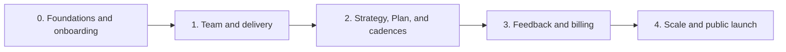

# branderize-cmo end-to-end implementation plan

## Purpose

This is the implementation plan for the whole application, not only for the
console. It covers, as one coordinated delivery stream:

- database schema and migrations;
- authentication, tenancy, and Policy;
- the canonical work graph and all write boundaries;
- Eve runtimes, agents, dispatch, and sessions;
- provider connections and external operations;
- the product console, public website, and self-service journeys;
- credits, billing, observability, and production operations;
- automated tests, real canaries, backup, and recovery exercises.

The frontend is a workstream inside every phase. It does not have a parallel
roadmap: a capability is complete only when its canonical data, server boundary,
runtime, user surface, and end-to-end verification ship together.

The five macro-phases extend the roadmap in
[ARCHITECTURE.md](./ARCHITECTURE.md#roadmap). A phase may contain several pull
requests and work packages, but it is not complete until every mandatory journey
for that phase is independently testable from the browser down to the canonical
data or external receipt.

## Verified baseline

At the time of writing, the repository is an advanced architectural
specification on top of a scaffold, not a partially implemented product:

- `apps/app` and `apps/web` are still Next.js 16 scaffolds;
- `apps/agent` declares Eve 0.31.3 but does not contain a working agent;
- `packages/ui` contains shadcn primitives, not product components;
- `packages/db`, `packages/brain`, `packages/policy`, `packages/connections`,
  `packages/agents`, `packages/marketing-skills`, and `packages/env` do not exist;
- Better Auth, Neon/Drizzle, Vercel Blob, Context.dev, Vercel Connect, AI Gateway,
  marketing providers, and billing are not implemented;
- there is no test runner, migration suite, browser E2E suite, or CI workflow;
- current commands build only the two Next.js apps and type-check `app`, `web`,
  and `ui`; no agent is built or verified;
- the root package declares Node `>=18`, while Eve requires Node 24.

The approved [wireframe](./design/branderize-cmo-wireframe.png) and
[realistic rendering](./design/branderize-cmo-realistic-render.png) remain
cross-phase references for information hierarchy and art direction. They are not
a phase and they are not a source of domain truth.

## Normative sources

This document sequences the work but does not redefine the contracts. When a
detail is ambiguous, the following sources take precedence:

- [ARCHITECTURE.md](./ARCHITECTURE.md), for the system map;
- [ADR-001](../adrs/001-multi-tenant-saas.md), for tenancy and roles;
- [ADR-002](../adrs/002-postgres-work-graph.md),
  [ADR-008](../adrs/008-brain-write-path-and-model-resolution.md), and
  [ADR-014](../adrs/014-schema-singletons-sessions-streams-ledger.md), for the
  graph, schema, model resolver, and write path;
- [ADR-011](../adrs/011-operational-invariants-for-agent-work.md) and
  [ADR-012](../adrs/012-contracts-approval-brief-intents-compiler.md), for
  operational invariants, shared task contracts, Intent lifecycle, and atomic
  Plan publication;
- [ADR-009](../adrs/009-agent-deployment-and-console-data-surface.md),
  [ADR-015](../adrs/015-the-registry.md),
  [ADR-017](../adrs/017-consultative-subagents-durable-root-work.md), and
  [ADR-018](../adrs/018-one-shot-durable-agent-tasks.md), for deployments,
  agents, the registry, and durable tasks;
- [ADR-013](../adrs/013-policy-matrix-lateral-edges-sandbox.md) and
  [ADR-019](../adrs/019-human-approved-external-commitments.md), for Policy,
  lateral work, and external effects;
- [ADR-010](../adrs/010-plan-as-derivation.md),
  [ADR-020](../adrs/020-typed-decisions-and-impact-verification.md), and
  [ADR-021](../adrs/021-plan-advancement-and-human-readiness-override.md), for
  Strategy, Plan, Verification, and advancement;
- [ADR-016](../adrs/016-eve-session-state-persistence.md), for conversation
  privacy, persistence, and recovery.

## Execution rules

### Every phase is a vertical slice

Every feature crosses the following layers in one workstream:

1. schema, migration, and closed typed contract;
2. Policy, tenancy, replay, and concurrency rules;
3. `packages/brain` boundary and read projections;
4. registry, runtime, or external adapter when required;
5. product UI with happy, empty, loading, error, stale, and permission states;
6. verification from the browser to the canonical row or provider receipt;
7. telemetry, runbook, and rollback proportional to the risk.

A schema without a user journey and a UI powered only by fixtures do not close a
macro-phase. Fixtures remain an internal development harness.

### Package dependency direction

The dependency direction remains fixed:

```text
packages/db + packages/policy + packages/agents registry
  -> packages/brain
  -> apps/app and deterministic adapters
  -> agent roots and dispatcher

packages/connections
  -> authenticated read tools and direct handlers
  -> never tokens in the graph, tasks, or sessions
```

- `packages/brain` is the only canonical graph write path.
- Applications may depend on `brain`; `brain` never depends on an application.
- Every Eve root mounts thin local wrappers generated from the shared registry.
- The public website does not import the agent runtime or direct graph access.
- Environment variables are validated per deployment; there is no implicitly
  shared `.env` across projects.
- Package owners declare their own test and build tasks; the root orchestrates
  them with `turbo run`.

### Cross-phase sequencing invariants

Some foundations must exist before their customer-facing configuration exists:

- Every brand-addressed proxy or client resolves `brand -> agent endpoint`
  through a lookup from Phase 0. Phase 0 may return the same compiled default for
  every brand; Phase 4 adds per-brand overrides without changing the call path.
  The shared Cron remains a payload-free fleet poke and never resolves a task or
  brand from request input.
- Phase 0 creates the deterministic marketing-skill materialization slot and
  makes it part of `eve build`. The Phase 0 Product Marketer uses core
  instructions only. Phase 1 installs, rewrites, and mounts the selected
  `packages/marketing-skills` corpus before enabling the wider roster.
- The shared model-resolution and AI Gateway attribution factory exists before
  the first model call or `model_charge`. Later `model_override` Decisions only
  add a new input to that already-shared resolver.
- The common `TaskCompletion` schema includes `intent_acceptance` in Phase 0,
  but every Phase 0-2 kind declares that it cannot emit it. `finishTask` rejects
  a non-null value fail-closed until Phase 3 introduces the complete Verification
  and settlement path and explicitly enables eligible kinds.
- Phase 1 may persist a terminal provider-outcome Verification. Once Plan routes
  exist, Phase 2 must also deliver the distinct provider-final Plan wake-up
  creator; a Plan-derived asynchronous commitment may not ship without it.
- Credit admission applies only to new agent-lane claims. It never blocks a CMO
  conversation, whether new, idle, streaming, or resumed, and it never revokes a
  direct commitment already approved by a human.

### No false capability

- A control appears only when its real boundary is active.
- A fake adapter, scripted inference provider, or controlled clock can be
  selected only by a server-side test build.
- A production build fails if it contains or can resolve a test provider.
- The fixture lab is always labelled `Synthetic data`, is `noindex`, and cannot
  be enabled by a query string, cookie, header, or browser input.
- The model is never an authorization boundary.
- Every external publish, send, activate, spend, pause, unpublish, cancel, or
  close keeps the human button required by ADR-019.

## Common definition of done

Phase 0 establishes one script convention. From then on, every phase must pass
from the repository root:

```text
pnpm check
pnpm check-types
pnpm test
pnpm test:integration
pnpm test:e2e
pnpm build
```

Root scripts delegate to Turbo; packages own their suites. The `main` gate runs
the complete graph. Pull requests may add an `--affected` lane, but it never
replaces the full gate.

Every phase also requires the following evidence.

### Contracts and database

- positive and negative parsing for every closed schema introduced;
- migrations from an empty database and from the previous release;
- constraints, partial indexes, same-brand foreign keys, and cascades tested on
  real PostgreSQL;
- replay, lost-response behavior, and the normative races owned by each ADR;
- no domain test implemented only with a Drizzle mock or in-memory database.

### Agents and providers

- real Eve runtime, proxy, hooks, and `brain` boundaries in tests;
- a test-only scripted inference provider for deterministic tool calls,
  streaming, partial results, errors, and retries;
- `eve build`, health check, and one complete session for every changed root;
- test-only provider adapters that record calls and receipts without making an
  external request;
- a separate staging canary with a real model or provider when first introduced.
  The canary supplements deterministic CI and never replaces it.

### Browser and product

- one E2E that crosses browser, Server Action or proxy, boundary, database, and
  rendered response;
- assertions on canonical rows or receipts, not only on visible text;
- the `owner | admin | member | viewer` matrix, removed Member, and cross-tenant
  cases;
- WCAG 2.2 AA, keyboard operation, visible focus, 200%/400% zoom, and no
  horizontal scroll at 320 px;
- deterministic screenshots at primary viewports and breakpoint edges;
- no private transcript in shared projections and no secret in HTML, browser
  logs, tasks, Actions, or model output.

### Operations

- updated environment schema, deployment manifest, and health check;
- correlation ids and sensitive-data redaction in logs;
- dashboards and alerts for the failure modes introduced in the phase;
- rollback procedures that preserve migrations, receipts, and UI promises;
- CI evidence: test reports, E2E trace, screenshot diff, and migration log.
  Green checks alone do not prove the product journey.

## Macro-phase summary

| Phase | Product increment | Journey that closes the phase |
| --- | --- | --- |
| 0 | Foundations and the first usable canonical state | sign in -> brand -> Intent -> Brand Context -> CMO declaration/refinement -> Object provenance |
| 1 | A team that delivers and the first human commitment | request work -> task/lateral -> Artifact -> approval -> one provider call -> Result |
| 2 | A habitable graph with Strategy and Plan | Strategy -> Decision -> rebuild -> Plan -> wave -> answer -> digest |
| 3 | Measurable feedback and economics | commitment -> outcome -> metric -> Verification -> credits/billing |
| 4 | Scale and public self-service | human or agent-native signup -> Plan -> approved commitment -> operational verification |



---

## Phase 0 - Foundations and the first usable canonical state

### End state

A user can sign in, create an organization and brand, declare the first Intent,
import a verifiable Brand Context, speak with their private CMO, and refine the
Intent. Intents, Objects, and Actions are canonical and organization-readable;
the conversation remains owner-private.

This phase includes the design system and frontend test harness. There is no
earlier, separate "UI phase."

### Included work packages

#### Platform and quality

- align the repository and CI on pnpm 9, Node 24, and Turbo;
- pin `apps/app` and `agent-cmo` to the same exact Eve version, with no semver
  range, and fail CI on manifest or resolved-version drift;
- add an Eve-upgrade gate that replays representative ordered persisted root
  event-stream fixtures through the candidate version's
  `defaultMessageReducer()` and compares the resulting `EveMessageData` with
  the approved projection before either dependency may move;
- introduce Vitest or an equivalent runner for unit/contract tests, real
  PostgreSQL for integration tests, and Playwright plus Axe for E2E;
- add CI workflows, failure artifacts, and environment contracts for every app;
- run `apps/web` on port 3000 and `apps/app` on port 3001 as two distinct
  Playwright `webServer` processes;
- create server-only fixtures, a controlled clock, and a scripted inference
  provider;
- establish the theme, typography, responsive shell, accessibility primitives,
  and visual-regression governance from the approved visual references;
- build `apps/app`, `apps/web`, and every agent root present in CI.

#### Data, authentication, and domain

- create `packages/env`, `packages/db`, `packages/policy`, `packages/brain`, and
  the registry core in `packages/agents`;
- configure Drizzle and `pg.Pool` against the pooled Neon URL, with a direct
  connection for migrations;
- implement Better Auth User, organization, Member, and Google sign-in;
- implement brand, Human/System/Agent Actor, active human Intent, Action, Object,
  Blob reference, task, completion, and operation receipt needed by the phase;
- introduce `session_events` and the append-only `credit_ledger` core from the
  first model step. Pricing and billing UI arrive in Phase 3, but attribution and
  idempotency do not wait;
- seed a deterministic, non-commercial alpha grant so the first agent task uses
  the real admission path. Customer pricing and replenishment are not inferred
  from this seed;
- implement initial tenant-safe projections and the pure Policy evaluator;
- materialize the Human Actor idempotently and derive authorization only from
  the current organization Member;
- create the `schedules` table, the active/retired `ScheduleTemplate` registry
  union, and `reconcileBrandSchedules`. Brand creation inserts current templates
  disabled, without exposing configuration or materialization yet.

#### Model resolution, attribution, and routing

- build one shared model-config factory in `packages/agents` and use it in every
  generated model-bearing wrapper;
- implement the fixed resolution order: global compiled fallback, then the
  per-specialist registry default, then an active per-brand `model_override`
  Decision selecting only a registered `model_profile_key`. In Phase 0 the third
  level has no writable producer yet, but the resolver contract and lookup shape
  already exist;
- return the complete Eve selection object and merge existing model and provider
  options rather than replacing them;
- reserve trusted `gateway.user = brand_id` and registry-derived
  agent/feature/lane/environment tags; browser, model, and task payload cannot
  override them;
- degrade resolver failure to the compiled fallback while still recording a
  winning billable `step.completed` locally;
- implement the `brand -> agent endpoint` resolver now, backed by a compiled
  shared default. The CMO proxy must call this resolver rather than a hard-coded
  URL;
- create the deterministic marketing-skill materialization command, workspace
  extension slot, dependency, and `eve build` ordering. It is empty or
  core-instructions-only in this phase; Phase 1 supplies the selected skill
  corpus.

#### Initial context

- implement the server-side Context.dev adapter for brand kit and crawl;
- validate, hash, and upload binary variants to Vercel Blob before canonical
  graph commit;
- implement the authenticated, brand-scoped Blob-delivery boundary: authorize
  the current organization Member through the Artifact's exact brand path and
  serve only its canonical `blob_key`; upstream URLs remain provenance only;
- commit Brand Context v0 and its Artifact through `packages/brain` with Actor
  `system:context-dev`;
- expose explicit retry and an import status projection without manufacturing a
  Brand Context when the external import fails.

#### Eve, task, and minimal CMO

- replace the generic `apps/agent` scaffold with the seven planned root targets
  and compile one shared manifest. CMO and Product Marketer are functional in
  this phase; other roots expose only health/registry and no active task kinds;
- implement `agent-cmo`, the authenticated `apps/app` proxy, application-owned
  conversations, streaming/reconnect, and the shared audit hook;
- project model usage from the winning `step.completed` for the first
  conversation and task, including replay and compaction behavior;
- implement one Product Marketer task, claim, typed `TaskCompletion`, normalized
  output, and a task-produced Object;
- include `intent_acceptance` in the common completion schema, while every
  Phase 0-2 kind is registered ineligible and `finishTask` rejects a non-null
  value;
- implement queue, claim, Vercel Cron fan-out, and payload-free dispatch for that
  task. Later phases extend this mechanism and do not introduce another queue;
- retain a `partial | blocked` completion and show its questions in task detail.
  Any current non-viewer Member may answer them from that Member's own top-level
  CMO conversation; this is not restricted to the original task requester. A
  `task_questions_resolved` receipt closes the immutable bundle without resuming
  or rerunning the old task. The aggregated inbox arrives in Phase 2;
- implement receipt-first `declareIntent` through both trusted Phase 0 entry
  points: an authenticated human product mutation and the top-level CMO acting
  on the current non-viewer human's explicit, unambiguous objective. Both create
  a human-authored active revision-1 Intent; the direct Action Actor is the human
  while chat transduction uses the CMO Action Actor. Trusted context derives
  tenant, author, branch, request identity, and conversation/turn provenance,
  and exact replay returns the first receipt without another write. Phase 0
  accepts only root declarations with `parentIntentId = null`;
- mount read-only Product Marketer consultation and the trusted top-level-CMO
  `refineIntent` wrapper;
- expose `request_specialist_work` only in the top-level CMO and only for the
  Product Marketer kind. The current human turn must identify one active Intent
  without ambiguity; trusted code constructs the snapshot;
- use a deny-all local sandbox when no backend can enforce the network allowlist.

#### User surface

- minimal landing/sign-in in `apps/web`;
- organization/brand onboarding, website, initial Intent, and import status in
  `apps/app`;
- console v0 with brand switcher, Intent detail, Object browser, authenticated
  preview/download for canonical Brand Context binaries, and provenance;
- minimal Work detail for the Product Marketer task, including outputs and open
  questions;
- private CMO with send, stream, stop, reload, and read-only fallback;
- no Strategy, Plan, approval, proposal, or schedule controls before their real
  boundaries exist.

### Mandatory journeys

1. **Canonical onboarding**
   - authenticate;
   - create organization and brand with `website_url`;
   - declare human Intent active revision 1;
   - run the Context.dev adapter;
   - create Brand Context and Artifact with producing Action;
   - preview/download the mirrored binary through the authenticated Blob-delivery
     route, while an unauthenticated or cross-brand request fails closed;
   - traverse from the browser to the exact Actor and provenance.
2. **CMO declaration and refinement**
   - the owner opens their own conversation;
   - in one explicit top-level turn, the human asks the CMO to declare a second
     root Intent and request Product Marketer work for it;
   - the CMO creates the human-authored active revision-1 Intent with the CMO as
     producing Action Actor; a repeated declaration call returns the exact
     receipt, and the separate `request_specialist_work` call may target that
     returned Intent only after the ordinary active/same-brand, Policy,
     capability, and credit guards pass;
   - the CMO consults Product Marketer and asks a question;
   - an unambiguous answer refines the Intent;
   - reload and reconnect preserve canonical state and transcript;
   - a `partial | blocked` task question remains until a later CMO turn resolves
     the bundle; opening it does not hide it or rerun work.
3. **Privacy and tenancy**
   - Bob, in the same organization, reads Alice's Intent/Object;
   - Bob cannot list or open Alice's conversation even when Bob is an admin;
   - another organization cannot read or mutate the brand;
   - a viewer who owns the conversation can read it and stop only the exact
     observed turn.
4. **Model attribution and endpoint resolution**
   - the brand-addressed CMO proxy resolves through the endpoint lookup;
   - the payload-free Cron pokes the configured shared root endpoints without a
     brand or task id;
   - CMO and Product Marketer choose their registry defaults over the global
     fallback through the same resolver factory;
   - the generated Gateway user/tags identify the trusted brand and registry
     actor/lane;
   - an attempted runtime override fails, while resolver fallback still records
     the winning local charge exactly once.

### Exit gate

Phase 0 is complete when all four journeys pass in CI through the real boundaries
with scripted Context.dev and inference, then pass in staging with Google auth,
Context.dev, Blob, Neon, and a real AI Gateway model. Product Marketer must create
at least one task-linked Object. Every root must pass build and health checks,
the endpoint resolver must be used by every brand-addressed proxy/client even
though it returns one shared deployment, and the marketing-skill materialization
slot must run before `eve build`. CI must also prove exact `apps/app`/`agent-cmo`
Eve-version parity and pass the persisted-stream reducer-compatibility fixture
against the installed candidate version. A fixture-only console does not close
the phase.

### Not active yet

- Content, Distribution, SEO, Lifecycle, and Growth work;
- draft Intent proposals from autonomous roots;
- provider connections and external commitments;
- Strategy, Plan, administrative Decisions, and configurable schedules;
- customer-facing credits, billing, MCP, and ads.

---

## Phase 1 - A team that delivers and the first human commitment

### End state

From an active Intent, the CMO can request durable specialist work. Content,
Distribution, and SEO Discovery produce traceable Artifacts/Evidence and may
hand work to an allowed lateral specialist. Autonomous roots can propose draft
Intents for human adoption. At least one kind can prepare a proposal for a real
provider; the external effect starts only after human review and produces a
canonical Result.

### Included work packages

#### Registry, agents, skills, and dispatch

- complete compiled registry entries for CMO, Product Marketer, Content,
  Distribution, and SEO Discovery;
- install `packages/marketing-skills`, select and rewrite the approved upstream
  skills, materialize them through the Phase 0 slot, and mount them through the
  workspace extension before `eve build`;
- generate thin local wrappers, tool sets, output contracts, sandboxes, model
  config, and supported task kinds;
- extend the top-level CMO `request_specialist_work` allowlist from the Phase 0
  Product Marketer kind to the enabled Content, Distribution, and SEO Discovery
  kinds. The same current-human, unambiguous-active-Intent, Policy, capability,
  and credit guards continue to apply; the CMO gains no raw origin selector.
  Root-to-root creation remains available only through the separately registered
  `request_lateral_work` edges;
- extend the Phase 0 queue, claim, and dispatcher to the new roots and kinds,
  including settlement, cancel, and complete task output inventory. Recovery may
  retry only an unproven handoff; after session binding there is no redispatch;
- record session/step telemetry and model usage without using telemetry as
  product state.

#### Lateral work

- implement registry-declared lateral edges and
  `request_lateral_work({ kind, payload, rationale })` for durable roots;
- derive source task, brand, parent, and common-origin branch from trusted task
  context; model input cannot name them;
- enforce exact source-worker to target-worker edge compatibility and preserve
  the exact Intent or Plan/Move branch;
- persist `parent_task_id = source_task_id` only for a newly inserted lateral;
  observing an active equivalent neither reparents it nor creates an alias;
- prove the Content-to-Distribution Artifact handoff without using chat output
  or a blob/token payload as canonical transfer.

#### Draft Intent proposals

- implement allowlisted `proposeIntent` for CMO/durable roots, inserting an
  agent-authored revision-1 `draft` and `intent_proposed` Action atomically;
- keep Phase 1 proposals root-level with `parentIntentId = null`; decomposition
  remains fail-closed until the Phase 2 lifecycle boundary is available;
- add the separate **Intent proposals** projection; drafts cannot authorize
  tasks, Policy, preauthorization, acceptance, or external work;
- implement human-only `adoptIntent` with revision CAS and `intent_adopted`;
- implement human-only `abandonIntent` for draft or active rows with revision
  CAS and `intent_abandoned`; it preserves accepted task snapshots and Objects;
- render Adopt/Abandon only for current `owner | admin | member` and test replay,
  stale revision, cross-tenant, viewer, and concurrent refinement.

#### Connections and preparation

- create `packages/connections` and `brand_connections`;
- implement Vercel Connect onboarding for the first Notion and Typefully slots;
- always use an app-scoped subject and resolve the brand-scoped installation in
  trusted code;
- expose only registry-declared read or create-only preparation operations;
- pass document and asset ids, never blobs or provider tokens, between agents.

#### Direct commitments, conflict, dismissal, and reopen

- implement `direct/human` tasks, closed renderer, edit, approve, cancel, and the
  one-shot deterministic direct handler;
- evaluate the current Member and Policy at the click, then freeze Approval,
  exact task id/revision, final payload hash, effect signature, authorized
  external-effect cost bound, Policy snapshot, resolved billing snapshot, and
  the conflict key when the kind is serialized;
- resolve the brand-owned current active provider connection at execution time,
  and record the effective provider/account identity only in the Result receipt.
  Provider kind/slot and connector operation remain registry-fixed and are
  validated at Approval and claim, but v1 does not pin a provider account or
  connection id in the Approval Action;
- append the Result and settlement under the exact ADR-019 transaction rules;
- require every registered commitment kind to declare `independent` or
  `serialized`. Independent kinds have no conflict key; serialized kinds derive
  a trusted `commitment_conflict_key` and enforce the active partial unique
  backstop;
- derive and attempt the serialized conflict key inside `approveTask` from the
  human-reviewed final task revision and payload, then rederive/revalidate it at
  claim. Distinct proposals may coexist in `awaiting_approval`; only the losing
  Approval click returns `target_busy`. It is a diagnostic, not a Task status:
  the proposal remains `awaiting_approval`, no Approval Action or FIFO waiter is
  created, and a human must click again after the blocker terminalizes. Conflict
  derivation never depends on the execution-time connection id;
- restrict every Phase 1 commitment kind to non-financial effects. Financial
  kinds cannot be registered until the Phase 3 four-eyes rule exists;
- implement `dismissed` plus its Dismissal Action and exact remembered identity
  `(brand, kind, canonical payload hash)`;
- implement the Reopen Action and its authorization/replay path. Dismissal and
  reopen change proposal eligibility but never rewrite the historical payload,
  Approval, Result, or Action. Reopen never reactivates or approves the dismissed
  Task; it only permits a new equivalent proposal that needs a fresh Approval;
- implement provider-outcome polling only for contracts with a durable lookup
  and bounded cadence. If the first kind uses it, terminal provider Verification
  is delivered here as an origin-free fact; Plan wake-up is added in Phase 2;
- freeze the billing snapshot at Approval. The first kind may be explicitly
  `non_billable`; any priced kind already writes one `action_charge` only for a
  validated `succeeded` Result.

#### User surface

- initial Today view with human-attention items, active work, and recent results;
- Work list/detail with polling only while work is active;
- extend the Phase 0 authenticated Blob-delivery path to Phase 1 Artifact
  previews/downloads and Evidence detail, with provenance;
- Connections with slot, effective account, capability gap, and reconnect;
- dedicated approval inbox with kind-specific CTA, never "Approve all";
- separate Intent proposals inbox with Adopt/Abandon;
- explicit stale, queued, running, failed,
  `outcome_unknown`, expired, `needs_regeneration`, dismissed, superseded, and
  reopened states, plus busy/`target_busy` only when an enabled kind declares
  serialized concurrency.

### Mandatory journeys

1. **Specialist and lateral work**
   - a human explicitly requests work for the current Intent;
   - the CMO creates or observes the root task;
   - Content claims it, creates an Artifact, and requests the registered
     Distribution lateral by Artifact id;
   - both completions, origin, parent edge, outputs, and producing Actions are
     visible after reload.
2. **Draft Intent**
   - an allowlisted root proposes a draft;
   - the draft appears only under Intent proposals and cannot start work;
   - one human adopts it or abandons it through revision CAS;
   - concurrent/replayed decisions converge and preserve the agent author.
3. **External delivery**
   - a task prepares a proposal;
   - the proposal appears in the approval inbox;
   - an authorized Member reviews or edits and approves it;
   - exactly one provider call occurs;
   - receipt, Result, optional terminal Verification, and terminal state remain
     readable after reload.
4. **Serialization, dismissal, and authority**
   - two independent proposals may proceed concurrently;
   - if any shipped kind is `serialized`, two proposals for the same target
     coexist while awaiting human review, then two Approval clicks produce one
     winner and one `target_busy` diagnostic with no Approval Action or queued
     waiter;
   - otherwise registry/compile tests prove every shipped kind is explicitly
     `independent`, the serialized mechanism still passes its closed server-side
     contract fixture, and no `target_busy` control or state is rendered;
   - dismissal prevents the exact remembered proposal from silently returning;
   - an explicit Reopen Action permits a new proposal without reactivating the
     old Task or erasing history;
   - double click and lost response converge; viewer/removed Member cannot
     approve; edit-vs-approve and cancel-vs-claim have one winner.

### Exit gate

Phase 1 is complete when all four journeys pass with deterministic providers in
CI and every connector declared for v1 passes in a staging workspace/account.
The canary must prove provider call, Result Action, and read-back rather than only
an HTTP 200. The Content-to-Distribution lateral, one draft Intent adoption, one
dismissal/reopen flow must be browser-visible and verified against canonical
rows. The serialized conflict mechanism and its concurrency contract tests are
always mandatory. Its `target_busy` branch is browser-visible only when a shipped
Phase 1 kind is registered as `serialized`; otherwise registry/compile tests must
prove every shipped kind is explicitly `independent` and the UI must expose no
conflict capability. Secrets must never appear in graph or stream. Notion and
Typefully are not delivered until each has a dedicated journey and canary. If v1
is reduced to one provider, roadmap, registry, and Connections UI must change in
the same commit; the second provider cannot remain a false promise.

### Not active yet

- Strategy, Plan, and automatic waves;
- configurable product schedules;
- automatic Intent-acceptance settlement;
- Lifecycle/Growth measurement, commercial billing, and MCP.

---

## Phase 2 - A habitable graph with Strategy, Plan, and cadences

### End state

The CMO coordinates all active Intents in one brand-wide Strategy and a versioned
Marketing Plan. Phase 1 specialist work is routed in waves, the Plan reevaluates
after ordinary and provider-final facts, incomplete questions return to humans,
and the first brand-wide cadence can be enabled without manufacturing authority.

### Included work packages

#### Decisions and complete Policy surface

- implement the closed `roadmap_input | policy_restriction | model_override |
  intent_preauthorization` schema and read model;
- enable only variants whose complete downstream contract is available. The
  first Strategy uses `impact.not_applicable`; measurable Decisions remain
  fail-closed with no CTA until Phase 3 atomically creates the Growth task;
- implement read-only presentation cards, durable recommendation reports, and
  human `recordDecision`;
- wire active `model_override` heads into the Phase 0 resolver. The Decision may
  select only a registered `model_profile_key`; the resolver must preserve the
  precedence global fallback -> specialist default -> active brand override and
  expose exact Decision provenance without becoming an arbitrary model picker;
- implement expected head/revision, receipt-first replay, supersession, and
  preauthorization bound to the exact Intent revision;
- display a stale positive preauthorization as **needs reconfirmation** without
  restoring authority;
- keep Strategy brand-wide; an optional Intent is causal provenance only.

#### Intent lifecycle

- complete Intent list/detail/history for `draft | active | settled | abandoned`;
- expose the already-implemented `adoptIntent`/`abandonIntent` boundaries in the
  full lifecycle surface and add the explicit human-only `settleIntent` path;
- enable decomposition only through the existing receipt-first creator
  boundaries. A current human product action or top-level CMO acting on that
  human's explicit request may `declareIntent` an active child; an allowlisted
  autonomous CMO or durable root may `proposeIntent` a draft child;
- for non-null `parentIntentId`, require an exact same-brand parent and non-empty
  rationale, then commit immutable `parent_intent_id` plus that rationale in the
  same `intent_declared` or `intent_proposed` Action transaction. There is no
  mutable parent setter or generic decomposition capability; consultative
  subagents and System Actors write nothing, and a draft child cannot originate
  work before adoption;
- make active-to-settled and active-to-abandoned changes contribute to
  `plan_needs_rebuild`, while never cancelling or reinterpreting accepted tasks;
- keep automatic acceptance disabled for every Phase 0-2 kind even though the
  common completion field already exists.

#### Plan, wave, and wake-up

- implement Evidence, Move Candidate, and Marketing Plan with exact Object ids;
- implement `rebuild-marketing-plan`, typed snapshots of all active Intents,
  atomic `publishPlanAndRoute`, and task create/observe mappings;
- implement `advance-marketing-plan`, wave Actions, ancestry wake-up,
  human Recheck, and Start anyway;
- compute `plan_needs_rebuild` from the current Strategy and active Intent
  snapshots; never use `output_object_ids` or terminality as readiness proof;
- implement the dedicated post-commit provider-final wake-up creator in the same
  release as Plan advancement. It accepts only trusted terminal Verification id,
  revalidates Verification -> poll -> accepted Result -> originating Plan-derived
  commitment, and uses a creator key distinct from the acceptance signal;
- keep pending polls origin-free and silent. A terminal Verification only wakes
  evaluation; it never proves readiness, becomes a route, or imports Policy.

#### Open questions, digest, and graph

- extend Phase 0 task-linked resolution into the shared projection of every
  `partial | blocked` completion with non-empty questions;
- let any current non-viewer Member open the exact question in that Member's own
  top-level CMO conversation, regardless of who originally requested the task;
- supply the source task through trusted turn context and close the bundle only
  with a receipt-backed `task_questions_resolved` Action;
- never resume or automatically rerun the old task. New work still requires an
  explicit human request and the ordinary guards;
- build the mechanical digest plus narrative with validated citation refs;
- complete graph browser, task queue, Intent lifecycle, and Decision history.

#### Agent-authored rechecks

- implement the durable-root-only `scheduleRecheck` tool. Every shipped
  immediate kind that permits a follow-up declares exactly one deterministic
  registered `recheckKind`, owned by the same root and using a distinct queue
  identity. If the source accepts Plan-route origin, the target also declares
  `acceptsPlanRouteOrigin: true`; a recheck kind may point back to itself;
- accept from the model only the registry-validated payload, `due_at`, and
  human-visible rationale. Derive the current Task, target kind, brand, worker,
  subject, parent, and common-origin branch from trusted Eve/task context and
  the registry;
- commit the first cross-kind booking during the tool call through the canonical
  create-or-reschedule boundary. An Intent-bound booking requires the current
  Intent to remain active and captures its latest immutable snapshot; a
  Plan-routed booking preserves null Intent and the exact Plan/Move pair. An
  origin conflict writes nothing, and a committed booking survives a later
  source-task failure;
- when an equivalent running recheck targets itself, atomically replace its one
  `next_due_at`, `next_payload`, and `next_rationale` tuple with the single
  `UPDATE ... WHERE id = current_task_id AND status = 'running' RETURNING`
  transition. A zero-row result returns `task_closed` and never falls back to an
  insert or reschedule;
- store only the validated target-kind payload template, `due_at`, and rationale
  in that staged tuple; never cache a common-origin envelope, Intent snapshot, or
  parent in `next_*`. Settlement derives the successor origin from canonical
  source/current-Intent state and its parent from the completed occurrence;
- process the staged tuple only in terminal settlement. Success creates or
  observes at most one successor under a source-derived stable key, then clears
  `next_*`; an Intent-bound successor requires the Intent still be active and
  captures its then-current revision, while an inactive Intent suppresses the
  successor without rolling back source success. A Plan-routed successor keeps
  null Intent and the exact Plan/Move pair. Observing an existing compatible
  booking preserves that row's origin and parent;
- failure, cancellation, or direct/automatic exhaustion clears `next_*` and
  creates no successor. Keep acceptance-first ordering covered by contract
  tests while every Phase 0-2 kind still rejects non-null `intent_acceptance`;
- keep this authored mechanism completely separate from registered,
  human-configured product schedules.

#### Product cadence

- extend the active/retired registry introduced in Phase 0 with executable
  release templates;
- for every new active template, run explicit `reconcileBrandSchedules` backfill
  for existing brands and prove it does not overwrite configuration or cursor;
- implement human `configureSchedule` with revision CAS;
- use one shared, versioned wall-clock/DST helper;
- materialize occurrences categorically origin-free with current restrictions
  and `structure_level = null`;
- introduce the first daily-brief cadence, disabled by default;
- implement retirement and root-first rollout/rollback from ADR-009.

#### User surface

- complete Today according to the approved information hierarchy;
- Decision/Strategy cards that state scope and consequences;
- Plan detail with Moves, Evidence, dependencies, Rebuild, Recheck, and Start
  anyway;
- live task queue, cited digest, Intent proposals/lifecycle, parent/child links,
  decomposition rationale, Intent author, producing Action Actor, and Open
  questions;
- registered model-profile override and resolution-chain provenance;
- Schedules with closed templates, timezone, and next-run status;
- recheck due time, rationale, origin, and source provenance only when a shipped
  kind declares `recheckKind`; otherwise no production recheck state or control
  is exposed;
- current, rebuilding, stale, no-ready-moves, and blocked Plan states;
- provider-pending/final Plan states only when a shipped commitment kind declares
  a durable `verificationPoll` and accepts/preserves Plan-route origin; otherwise
  no production provider-final UI is exposed.

### Mandatory journeys

1. **Strategy and Plan**
   - the CMO presents a typed Strategy;
   - the human records the exact payload;
   - `recordDecision` atomically creates the rebuild;
   - the CMO publishes Plan, producing Action, and route mapping;
   - a task terminalizes and creates or observes a reevaluation;
   - the result is a new wave or `no_ready_moves`.
2. **Registered model override**
   - without an override, a new specialist session uses its registry default;
   - a human records an override that selects a registered profile;
   - a new session returns that profile's complete selection object
     `{ model, modelContextWindowTokens, modelOptions }`, with provider options
     merged non-destructively and trusted Gateway attribution applied;
   - supersession updates only later sessions, exact provenance remains visible,
     and an unknown profile cannot be recorded or resolved.
3. **Plan recovery, Intent lifecycle, and decomposition**
   - a Strategy change, Intent refinement, `settleIntent`, or `abandonIntent`
     makes the Plan stale;
   - a current non-viewer declares an active child from Intent detail and sees
     its parent, rationale, human author, and producing Action provenance;
   - an explicit top-level CMO request creates another active child with the
     current human as Intent author and the CMO as Action Actor;
   - an allowlisted durable root proposes a draft child that cannot originate
     work until adoption, while cross-brand, consultative, and System attempts
     commit neither Intent nor Action;
   - Recheck and Start anyway are blocked while Rebuild remains available;
   - Rebuild publishes a new current head without cancelling accepted work;
   - a lost best-effort signal is recoverable with human Recheck.
4. **Asynchronous provider-final wake-up**
   - when a shipped Phase 1-2 commitment declares eventual Verification through
     a durable `verificationPoll` and accepts/preserves Plan-route origin, a
     Plan-derived instance is accepted and triggers the first evaluation;
   - its poll records pending without waking the Plan;
   - a terminal Verification uses a distinct key and requests a second
     evaluation through the original commitment ancestry;
   - replay converges, a stale/unmapped Plan produces no write, and the poll
     remains origin-free;
   - the dedicated creator and its pending/non-Plan/stale/broken-chain contract
     tests are always mandatory through a closed server-side fixture;
   - when no shipped commitment declares that capability, registry/compile tests
     prove the absence and no production provider-final UI is exposed.
5. **Open questions**
   - a task completes `partial | blocked` with questions;
   - a shared card appears;
   - a different current non-viewer Member can answer through their own CMO;
   - the answer does not rerun the task;
   - the resolution Action hides the card and replay converges.
6. **Agent-authored recheck**
   - when a shipped Phase 1-2 immediate kind declares `recheckKind`, that
     production kind schedules its sole registered cross-kind recheck, which
     remains visible with due time, rationale, origin, and source provenance
     after the originating Task later fails;
   - in that positive branch, a running recheck schedules itself twice, leaving
     one complete `next_*` tuple from the last valid database write and no second
     active booking;
   - successful settlement creates or observes exactly one successor, clears
     `next_*`, and replay or a concurrent booking preserves the winning row's
     existing origin and parent;
   - an active refined Intent produces a successor with its latest revision, an
     inactive Intent produces no successor without undoing source success, and a
     Plan-routed fixture preserves null Intent plus the exact Plan/Move pair;
   - failed, cancelled, and exhausted settlement produces no successor, while a
     scheduling call that loses to terminalization returns `task_closed` with no
     fallback write;
   - the `scheduleRecheck`, registry-compatibility, and settlement contract suites
     remain mandatory through a closed server-side fixture;
   - when no shipped immediate kind declares `recheckKind`, registry/compile
     tests prove that absence and generated production root manifests expose no
     runnable recheck capability or production UI.
7. **Cadence**
   - a human enables daily brief with a timezone;
   - a controlled clock reaches the slot;
   - exactly one origin-free occurrence is created;
   - disable/materialize and duplicate dispatch linearize;
   - re-enable causes no catch-up, and DST gap/fold use the expected instants.

### Exit gate

Phase 2 is complete when all seven journeys pass their applicable positive or
negative branch on real PostgreSQL and Eve with scripted inference, including
one Content/Distribution/SEO path from Phase 1. The `scheduleRecheck` mechanism
and closed-fixture suite are always mandatory and must prove registry uniqueness
and compatibility, trusted identity derivation, cross-kind write durability,
the conditional self-recheck update, absence of cached origin or parent data in
`next_*`, success-coupled materialization, current-Intent eligibility, Plan/Move
preservation, and scheduling-versus-settlement races. A browser/staging recheck
journey with a genuine production-registered immediate/recheck pair is
additionally mandatory when a shipped immediate kind declares `recheckKind`; a
fixture-only kind cannot satisfy that positive branch. Otherwise the gate
requires the negative registry/compile and production-manifest proof above. The
dedicated provider-final creator contract suite remains mandatory. A
browser/staging provider-final journey is additionally mandatory when a shipped
commitment can produce a terminal provider-outcome Verification for a
Plan-derived instance; otherwise the gate requires the negative registry/compile
proof above. In
staging, a real model must complete presentation, Decision, rebuild, and Plan
evaluation. A real Cron must materialize daily brief for a staging brand without
performing an unapproved external commitment. No Phase 0-2 kind may persist
non-null `intent_acceptance`.

---

## Phase 3 - Measurable feedback, Lifecycle, and economics

### End state

The application observes provider outcomes, measures verifiable Decisions, and
uses those facts to reevaluate the Plan. Lifecycle and Growth are operational.
Models and successful priced actions consume an auditable credit ledger.
Financial commitments enforce separation of duties before any such kind can
ship.

### Mandatory preliminary decisions

The existing ADRs define ledger entries, charges, and overage but do not choose
the collection/invoicing contract. Before implementing commercial collection, a
short ADR must fix the billing provider, price catalog, invoice cycle, webhooks,
dispute/refund behavior, and relationship between commercial plan and
`credit_ledger`.

Before registering the first `financial` effect, a short ADR amending ADR-011
and ADR-013 must ratify the four-eyes rule and its closed Policy representation.
For Intent-bound work, the approving Human Actor cannot be the Intent author.
The Phase 3 implementation must encode that ratified rule; this is segregation
of duties, not a model judgment or an implied second provider call.

ADR-011 defines that comparison for Intent-bound work but does not identify an
author for Plan-routed or origin-free financial work. Those branches therefore
remain fail-closed until a later short ADR amendment defines and ratifies a
trusted comparison subject. Phase 4 ads cannot enable such a financial kind by
inference.

### Included work packages

#### Agents and connections

- make Lifecycle and Growth functional;
- add Resend for lifecycle and one registered analytics source;
- add read-only metric tools and idempotent preparation operations;
- keep every external send in the `direct/human` lane;
- show capability/data gaps instead of inventing metrics.

#### Verification and feedback

- enable measurable `roadmap_input` together with its Growth task created
  atomically by `recordDecision`;
- implement provider-outcome, Intent-acceptance, and Decision-impact
  Verification Actions;
- explicitly allow `intent_acceptance` only for the product-decision-selected
  registered Intent-bound kind with the complete acceptance schema and
  settlement boundary; all other kinds remain fail-closed;
- implement pending/final provider states, deadlines, and technical exhaustion;
- retain the provider-final Plan wake-up delivered in Phase 2 and extend its
  tests to Lifecycle providers rather than introducing a second mechanism;
- implement origin-free `verify-roadmap-decision-impact` and reconsideration
  reports;
- keep every Decision mutation behind a separate human click.

#### Four-eyes financial authority

- extend the Policy matrix and renderer for `financial` commitments;
- derive Intent author and approving current Human Actor from trusted canonical
  rows and reject equality before Approval is written;
- preserve current Member role checks and brand restrictions; four-eyes can
  tighten authority but never widen it;
- make same-author denial, different-author success, replay, removed Member,
  cross-tenant, and concurrent approval explicit contract/E2E tests;
- keep Plan-routed and origin-free financial commitments fail-closed until their
  trusted four-eyes comparison subject is ratified by the required ADR amendment;
- keep all financial kinds disabled in the registry until this suite passes.

#### Credits and billing

- make the Phase 0 append-only `credit_ledger` commercial, including grant,
  model charge, and action charge;
- project balance and admission without reservations;
- charge only winning billable steps and ignore compaction in the customer
  ledger;
- record an action charge only for a billable commitment that reaches
  `succeeded` with a validated stable receipt;
- block new agent-lane claims when balance is zero or negative. Never block any
  CMO conversation, Approval/cancel boundary, or execution of an already
  approved direct commitment;
- implement allowance, overage, collection, and invoicing from the billing ADR;
- compare AI Gateway Custom Reporting only as diagnostics, never as the
  canonical debit source.

#### User surface

- Lifecycle/analytics connection status and capability gaps;
- provider outcome and Verification in task detail and digest;
- metric Evidence and Decision-impact history;
- financial four-eyes explanation and the eligible approver state;
- credit balance, consumption, overage, blocked-work explanation, and billing
  documents;
- no estimated provider cost presented as a canonical charge.

### Mandatory journeys

1. **Provider feedback**
   - an asynchronous commitment is accepted and later verified;
   - pending and final states are canonical and visible;
   - a qualifying Plan gets the distinct terminal wake-up from Phase 2;
   - the poll remains origin-free and grants no authority.
2. **Intent acceptance and Decision impact**
   - the product-decision-selected eligible Intent-bound kind produces validated
     acceptance Evidence and the exact acceptance Verification/settlement path;
   - an ineligible kind's non-null `intent_acceptance` is rejected;
   - a measurable Decision creates its future Growth task;
   - Growth reads metrics, creates Evidence and Verification;
   - reconsideration remains a report until a human records a new Decision.
3. **Four-eyes financial commitment**
   - the Intent author cannot approve the financial proposal;
   - another currently authorized Member can approve it;
   - exactly one direct provider operation and Result occur;
   - replay and concurrency do not bypass separation of duties.
4. **Economics**
   - a billable step creates exactly one model charge;
   - replay of the same event id does not duplicate it;
   - a successful priced action creates one action charge; unknown/failed do not;
   - zero credit blocks a new agent task but not a CMO conversation,
     approve/cancel, or an already approved direct execution;
   - UI and invoice reconcile to the canonical ledger.

### Exit gate

Phase 3 is complete when all four journeys pass with deterministic clock and
providers in CI and with Resend, analytics, AI Gateway, and billing sandbox in
staging. At least one eligible Intent-acceptance path and one financial four-eyes
path must be proven end to end. An aggregate AI Gateway report is insufficient:
tests and canaries must show the corresponding session event, ledger row,
Action/Verification, and user projection.

---

## Phase 4 - Scale, MCP channel, and public self-service

### End state

A new customer or agent-native caller can use the application self-service
within the approved boundaries. Growth can prepare ads work, but every external
commitment remains human-authorized. The system has the deployment, security,
privacy export, observability, support, and recovery required for a controlled
public launch.

### Mandatory preliminary decision

Before registering a financial ads kind, a short ADR amendment must ratify its
actual origin branch. If it is Plan-routed or origin-free, the amendment must
define the trusted four-eyes comparison subject, how trusted code derives it,
and which evidence is frozen at Approval. Until that amendment is implemented,
the kind and its controls remain unavailable. Because the ads journey is
mandatory, the unresolved amendment blocks the Phase 4 exit gate.

### Included work packages

#### Public product

- complete `apps/web` with truthful positioning/pricing, sign-in/sign-up,
  privacy, terms, and service status;
- connect sign-up to organization/brand creation and Phase 0 onboarding;
- add Member/role management and offboarding without hard-deleting the Actor;
- make plan, allowance, overage, and included capabilities explicit;
- verify the complete funnel on mobile and desktop, not only the landing page.

#### MCP and agent-native use

- implement a read-by-default MCP server with tenant binding and closed scopes;
- allow writes only through existing boundaries and typed receipts;
- implement sign-up/deep-link handoff when organization, brand, or connection is
  missing;
- expose task/commitment status polling without making the MCP caller an
  approver;
- test malicious callers, guessed ids, and cross-tenant attempts.

#### Growth and deployment scale

- add registered ads connections to the Growth root;
- keep prepare/commit separate and every spend behind Approval and Phase 3
  four-eyes when classified `financial`; a Plan-routed or origin-free financial
  ads kind remains unavailable until its comparison-subject rule is ratified in
  the required ADR amendment and implemented;
- retain the Phase 0 brand-endpoint resolver and add optional per-brand dedicated
  endpoint overrides; do not add a second routing path;
- extend the payload-free fleet wake-up to the deduplicated inventory of shared
  and dedicated root endpoints, without adding brand or task payload to
  `/internal/dispatch`;
- complete and verify all seven Eve deployments;
- verify OIDC, Connect links, environment, and registry manifests in every
  affected project;
- implement rollout/rollback compatible with retired templates and accepted
  sessions/tasks.

#### Organization-wide GDPR export and retention

- turn ADR-011's deferred export into an explicit implementation contract before
  coding: eligible requester roles, included data classes, transcript treatment,
  delivery method, expiry, audit, and billing-document retention;
- implement an organization-wide export through a trusted human boundary with
  tenant checks and an immutable audit receipt;
- include canonical graph/account data required by the contract without turning
  visible Action session locators into a transcript read capability;
- preserve owner-private conversation rules in the live product while applying
  the explicit legal export contract, and redact provider secrets/tokens;
- test large exports, replay, expiry, removed Member, viewer, wrong organization,
  and deletion/retention behavior;
- keep provider-resource cleanup out of brand cascade unless a provider-specific
  contract explicitly adds it.

#### Production hardening

- rate limiting and abuse protection on sign-up, proxy, MCP, and internal
  endpoints;
- SLOs, dashboards, alerts, trace correlation, and incident runbooks;
- Neon backup/restore exercise, Blob-reference verification, and task recovery;
- load tests for CMO streaming, dispatch, task claim, Plan publication, and cron;
- security review of auth, tenancy, SSRF/egress, provider payloads, and secret
  redaction;
- browser support, performance budgets, visual regression, screen-reader smoke,
  and final accessibility audit;
- cohort feature flags with a verified rollback;
- support tooling that exposes receipts/provenance without revealing another
  Member's private transcript.

### Mandatory journeys

1. **Human self-service**
   - visit `apps/web`;
   - sign up and create a brand;
   - complete Context/Intent/CMO onboarding;
   - record Strategy and create the first Plan;
   - produce an Artifact and approve one commitment;
   - read its outcome, Verification, and charge.
2. **Agent-native journey**
   - an authenticated MCP caller reads a brand;
   - a missing capability returns a brand-scoped handoff;
   - a human completes connection or Approval in the console;
   - the caller observes the terminal receipt without approving it.
3. **Ads and dedicated endpoint**
   - Growth prepares a proposal for a test account;
   - preview states target, budget, and consequence;
   - an eligible human approves exactly one external operation under four-eyes;
   - one brand is routed through an endpoint override while another uses the
     default, with identical tenant and receipt guarantees.
4. **GDPR export**
   - an eligible organization Member requests an export;
   - the export contains exactly the ratified data classes and no secrets;
   - replay returns the same job/receipt rather than duplicating work;
   - an ineligible or cross-tenant requester receives no metadata or file;
   - retention/expiry and audit behavior match the ratified contract.
5. **Operational recovery**
   - restore a backup in an isolated environment;
   - redeploy/rollback during active tasks and sessions;
   - exercise duplicate Cron, provider timeout, and temporary root outage;
   - no commitment is duplicated and recovery uses the specified receipt/recheck
     path.

### Exit gate

Phase 4 is complete when all five journeys pass in a production-like environment
and a small real cohort completes self-service under active monitoring. Before
GA, the team must prove restore, rollback, tenant isolation, external approval,
economic reconciliation, GDPR export, and support escalation. Green CI, a
successful deployment, or the first CMO message is not sufficient.

## Coverage matrix

| Area | Owning phase | Extended later |
| --- | --- | --- |
| Toolchain, CI, test harness, visual system | 0 | every phase |
| Better Auth, organization, Member, brand, Actor | 0 | 4 for public self-service/offboarding |
| Intent, Action, Object, Brain, Policy | 0 | interactive declaration in 0, draft proposals in 1, full lifecycle and decomposition in 2 |
| Context.dev, Blob, Brand Context | 0 | 1-4 for new Artifacts |
| Model resolver, Gateway attribution, endpoint lookup | 0 | model overrides in 2, endpoint overrides in 4 |
| Eve CMO, Product Marketer, private sessions | 0 | 2-4 |
| Task, registry, dispatcher, completion | 0 | all |
| Marketing-skills materialization slot | 0 | selected corpus and agents in 1+ |
| Content, Distribution, SEO, lateral edges | 1 | 2-4 |
| Draft Intent proposal/adopt/abandon | 1 | lifecycle and Plan staleness in 2 |
| Vercel Connect, Notion, Typefully | 1 | 3-4 |
| Approval, conflict keys, dismissal/reopen, Result | 1 | financial four-eyes in 3 |
| Decision, Strategy, Plan, wave | 2 | 3-4 |
| Provider-final Plan wake-up | 2 | more provider kinds in 3-4 |
| Digest, graph, open questions | 2 | 3-4 |
| Product cadence and `scheduleRecheck` | 2 | 3-4 |
| Lifecycle, Growth, Resend, analytics | 3 | 4 |
| Intent acceptance and Decision impact | 3 | 4 |
| Credits, pricing, billing, financial four-eyes | 3 | 4 |
| Public web, MCP, ads, endpoint overrides | 4 | continuous operations |
| GDPR export and billing-document retention | 4 | continuous compliance |
| Observability, security, recovery | 0 | every phase, final gate in 4 |

## Product decisions required before their owning phase exits

The plan must not hide choices that are still open. The following decisions are
required before the corresponding code or exit gate:

- the real provider operation used for the first Phase 1 commitment and the
  actual credential/connector contract available for Notion and Typefully;
- the `independent | serialized` classification of every shipped commitment
  kind and, for each serialized kind, its trusted target, conflict-key
  derivation, and provider ordering or conditional-transition guarantee;
- the analytics source and minimum metric set for Phase 3;
- the first production Intent-bound task kind eligible to emit non-null
  `intent_acceptance`, including its acceptance Evidence Object types,
  same-task production path, and `satisfied | not_satisfied | inconclusive`
  contract; this decision blocks the Phase 3 Intent-acceptance journey and exit
  gate;
- price catalog, allowance, billing provider, and invoice lifecycle;
- the exact financial effect classes governed by four-eyes, recorded in the
  Phase 3 ADR amendment to ADR-011 and ADR-013;
- the actual origin branch of every financial ads kind and, for Plan-routed or
  origin-free work, its trusted four-eyes comparison subject, derivation, and
  Approval-time evidence, recorded in the Phase 4 ADR amendment; this decision
  blocks the Phase 4 ads journey;
- provider/account sandboxes used by external canaries;
- launch scope for ads and MCP capabilities;
- requester roles, included data, transcript treatment, delivery, and retention
  for the Phase 4 GDPR export;
- SLOs, operational retention, and support process for the initial cohort.

These decisions do not block work on earlier dependencies, but they block the
exit gate of the phase that owns them.

## Release strategy

- **After Phase 0:** internal foundational alpha with real onboarding and CMO,
  but no external-delivery promise.
- **After Phase 1:** limited operational beta on the first real connector.
- **After Phase 2:** beta of the complete Strategy -> Plan -> work loop.
- **After Phase 3:** measurable, economically accounted beta.
- **After Phase 4:** cohort-based public launch, then GA only after operational
  evidence.

Each release exposes only capabilities that have passed its exit gate. Later
phases are not previewed through dead controls, mock data, or fallbacks that
pretend success.
